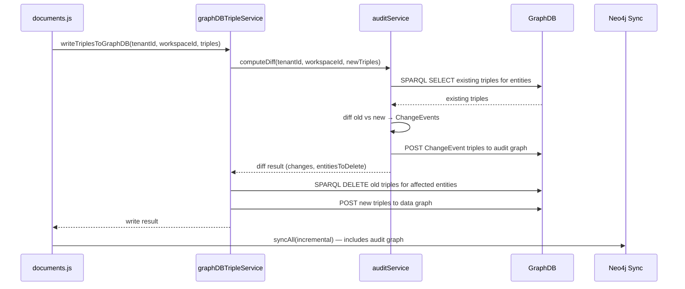

# Design Document: Audit Graph for Change Tracking

## Overview

This design introduces a per-workspace audit graph that records every data change as a ChangeEvent RDF node. The core change is to the commit flow: instead of blindly appending triples via POST, the system now queries existing triples, diffs them against new triples, writes ChangeEvents to a dedicated audit named graph, then performs a delete-before-insert on the data graph. This ensures no data change goes unrecorded and eliminates the stale-triple accumulation problem.

The audit data is queryable via SPARQL for AML compliance analysis and synced to Neo4j for visualization. REST API endpoints expose change history to the frontend.

## Architecture

The audit system integrates into the existing commit pipeline with minimal disruption:



Key architectural decisions:
- **One audit graph per workspace** — keeps audit data scoped and queryable per workspace
- **Audit-before-data write** — ChangeEvents are written first so the audit trail exists even if the data write fails
- **Delete-before-insert on data graph** — replaces append-only POST to eliminate stale triples
- **Reuse existing infrastructure** — uses `_fetchWithPool` for concurrency control, same batch sizes, same Turtle serialization

## Components and Interfaces

### 1. `auditService.js` (New)

The central audit service handling diff computation, ChangeEvent generation, and audit queries.

```javascript
class AuditService {
  /**
   * Query existing triples for a set of entity URIs from the data graph.
   * @param {string} tenantId
   * @param {string} workspaceId
   * @param {string[]} entityURIs - URIs of entities to query
   * @returns {Map<string, Array<{predicate: string, object: string, objectType: string}>>}
   */
  async getExistingTriples(tenantId, workspaceId, entityURIs) {}

  /**
   * Compute diff between existing and new triples.
   * @param {Map} existingByEntity - existing triples grouped by entity URI
   * @param {Array<string>} newTriples - new Turtle triple strings
   * @returns {{ changes: ChangeEvent[], entityURIsToDelete: string[] }}
   */
  computeDiff(existingByEntity, newTriples) {}

  /**
   * Generate ChangeEvent RDF triples from diff results.
   * @param {ChangeEvent[]} changes
   * @param {string} auditGraphIRI
   * @param {string} sourceDocumentURI
   * @returns {string[]} - Turtle triple strings for the audit graph
   */
  generateChangeEventTriples(changes, auditGraphIRI, sourceDocumentURI) {}

  /**
   * Write ChangeEvent triples to the audit graph in GraphDB.
   * @param {string} tenantId
   * @param {string} workspaceId
   * @param {string[]} auditTriples
   */
  async writeAuditTriples(tenantId, workspaceId, auditTriples) {}

  /**
   * Full pre-commit audit flow: query existing → diff → write audit → return delete list.
   * @param {string} tenantId
   * @param {string} workspaceId
   * @param {string[]} newTriples
   * @param {string} sourceDocumentURI
   * @returns {{ changeCount: number, entityURIsToDelete: string[] }}
   */
  async preCommitAudit(tenantId, workspaceId, newTriples, sourceDocumentURI) {}

  /**
   * Query change history for an entity.
   * @param {string} tenantId
   * @param {string} workspaceId
   * @param {string} entityURI
   * @returns {ChangeEvent[]}
   */
  async getEntityChangeHistory(tenantId, workspaceId, entityURI) {}

  /**
   * Query recent changes across the workspace with pagination.
   * @param {string} tenantId
   * @param {string} workspaceId
   * @param {{ limit, offset, changeType, dateFrom, dateTo }} options
   * @returns {{ changes: ChangeEvent[], total: number }}
   */
  async getWorkspaceAuditLog(tenantId, workspaceId, options) {}
}
```

### 2. `graphDBStore.js` (Modified)

Add audit graph IRI method:

```javascript
getAuditGraphIRI(tenantId, workspaceId) {
  if (!tenantId || tenantId === 'undefined') {
    throw new Error('tenantId is required for audit graph IRI');
  }
  if (!workspaceId || workspaceId === 'undefined') {
    throw new Error('workspaceId is required for audit graph IRI');
  }
  return `http://purplefabric.ai/graphs/tenant/${tenantId}/workspace/${workspaceId}/audit`;
}
```

### 3. `graphDBTripleService.js` (Modified)

The `writeTriplesToGraphDB` method changes from simple POST to:

```javascript
async writeTriplesToGraphDB(tenantId, workspaceId, triples, options = {}) {
  const { sourceDocumentURI } = options;
  
  // Step 1: Pre-commit audit (diff + write ChangeEvents)
  const auditResult = await auditService.preCommitAudit(
    tenantId, workspaceId, triples, sourceDocumentURI
  );
  
  // Step 2: Delete old triples for affected entities
  if (auditResult.entityURIsToDelete.length > 0) {
    await this.deleteEntityTriples(tenantId, workspaceId, auditResult.entityURIsToDelete);
  }
  
  // Step 3: Insert new triples (existing batch logic)
  // ... existing POST batch logic ...
}
```

### 4. `graphDBNeo4jSyncService.js` (Modified)

Extend `syncInstanceData` to also query the audit graph and create ChangeEvent nodes with `[:CHANGED]` relationships.

### 5. REST API Routes (New endpoints in `documents.js`)

```
GET /api/ontology/documents/:docId/audit
  → Change history for entities from a specific document

GET /api/ontology/audit/entity?uri={entityURI}&tenantId=...&workspaceId=...
  → Change history for a specific entity

GET /api/ontology/audit/log?workspaceId=...&limit=50&offset=0&changeType=UPDATE&dateFrom=...&dateTo=...
  → Workspace-wide audit log with filtering and pagination
```

## Data Models

### ChangeEvent RDF Model

Each ChangeEvent is an RDF node in the audit graph with the following structure:

```turtle
@prefix pf: <http://purplefabric.ai/ontology#> .
@prefix xsd: <http://www.w3.org/2001/XMLSchema#> .
@prefix rdf: <http://www.w3.org/1999/02/22-rdf-syntax-ns#> .

<http://purplefabric.ai/graphs/tenant/t1/workspace/w1/audit/event/uuid-here>
    rdf:type pf:ChangeEvent ;
    pf:entity <http://purplefabric.ai/graphs/tenant/t1/workspace/w1/data/entity/Customer/CUST001> ;
    pf:property <http://example.org/ontology#amount> ;
    pf:previousValue "5000"^^xsd:string ;
    pf:newValue "15000"^^xsd:string ;
    pf:changeType "UPDATE"^^xsd:string ;
    pf:changedAt "2025-01-15T10:30:00.000Z"^^xsd:dateTime ;
    pf:sourceDocument <doc://abc-123> .
```

### ChangeEvent JavaScript Object

```javascript
{
  entityURI: 'http://purplefabric.ai/.../entity/Customer/CUST001',
  property: 'http://example.org/ontology#amount',
  previousValue: '5000',
  newValue: '15000',
  changeType: 'UPDATE',  // INSERT | UPDATE | DELETE
  changedAt: '2025-01-15T10:30:00.000Z',
  sourceDocument: 'doc://abc-123'
}
```

### Parsed Triple Representation (Internal)

For diffing, triples are parsed into a structured form:

```javascript
{
  subject: 'http://...entity/Customer/CUST001',
  predicate: 'http://example.org/ontology#amount',
  object: '"5000"^^<http://www.w3.org/2001/XMLSchema#string>',
  objectValue: '5000',       // extracted literal value
  objectType: 'literal'      // 'literal' or 'uri'
}
```

### Neo4j ChangeEvent Node

```
(:ChangeEvent {
  uri: "http://.../audit/event/uuid",
  changeType: "UPDATE",
  property: "amount",
  previousValue: "5000",
  newValue: "15000",
  changedAt: "2025-01-15T10:30:00.000Z",
  sourceDocument: "doc://abc-123"
})-[:CHANGED]->(:Customer { uri: "http://.../entity/Customer/CUST001" })
```

### Diff Algorithm

The diff algorithm operates on entity-level triple sets:

1. **Parse new triples** — extract subject/predicate/object from each Turtle line
2. **Group by entity URI** — collect all predicates+objects per entity
3. **Query existing** — SPARQL SELECT for each entity's current triples in the data graph
4. **Compare per entity**:
   - For each (entity, predicate) pair in new data:
     - If not in old data → INSERT
     - If in old data with different object → UPDATE
     - If in old data with same object → no change (skip)
   - For each (entity, predicate) pair in old data but not in new data → DELETE
5. **Skip metadata predicates** — `rdf:type`, `pf:sourceDocument`, `pf:rowIndex`, `pf:lastUpdatedBy`, `pf:updatedAt` are excluded from diff to avoid noise


## Correctness Properties

*A property is a characteristic or behavior that should hold true across all valid executions of a system — essentially, a formal statement about what the system should do. Properties serve as the bridge between human-readable specifications and machine-verifiable correctness guarantees.*

### Property 1: Audit graph IRI determinism

*For any* valid tenantId and workspaceId strings, `getAuditGraphIRI(tenantId, workspaceId)` should return a string matching the pattern `http://purplefabric.ai/graphs/tenant/{tenantId}/workspace/{workspaceId}/audit`, and calling it twice with the same inputs should return the same result.

**Validates: Requirements 1.2**

### Property 2: Entity URI extraction from triples

*For any* set of valid Turtle triple strings, the entity URI extraction function should return exactly the set of unique subject URIs present in those triples (excluding metadata-only subjects like Document URIs and OWL declarations).

**Validates: Requirements 2.1**

### Property 3: Diff classification correctness

*For any* pair of old triple sets and new triple sets for the same entity, the diff engine should produce: INSERT for every (entity, predicate) pair present in new but not in old; UPDATE for every (entity, predicate) pair present in both with different object values; DELETE for every (entity, predicate) pair present in old but not in new; and no ChangeEvent for pairs with identical values. The total number of ChangeEvents should equal the number of INSERTs + UPDATEs + DELETEs, with no duplicates.

**Validates: Requirements 2.2, 2.3, 2.4, 2.5**

### Property 4: Unchanged triples produce no ChangeEvents

*For any* set of triples, if the old and new triple sets are identical, the diff engine should produce zero ChangeEvents.

**Validates: Requirements 2.5**

### Property 5: ChangeEvent triple completeness

*For any* ChangeEvent object with valid fields, the generated Turtle triples should contain all required predicates: `rdf:type pf:ChangeEvent`, `pf:entity`, `pf:property`, `pf:changeType`, `pf:changedAt`, and `pf:sourceDocument`. For UPDATE and DELETE events, `pf:previousValue` should be present. For INSERT and UPDATE events, `pf:newValue` should be present. All audit-specific predicates should use the PF namespace.

**Validates: Requirements 3.1, 3.3**

### Property 6: ChangeEvent URI uniqueness

*For any* set of ChangeEvents generated from a single diff operation, all assigned ChangeEvent URIs should be unique.

**Validates: Requirements 3.2**

### Property 7: ChangeEvent Turtle round-trip validity

*For any* ChangeEvent object, the generated Turtle triple strings should be parseable back into structured triples that preserve the original ChangeEvent field values (entity, property, previousValue, newValue, changeType, changedAt, sourceDocument).

**Validates: Requirements 3.4**

### Property 8: Audit triple batching preserves all events

*For any* set of ChangeEvent triples and any batch size, splitting into batches and concatenating should produce the same set of triples as the original (no triples lost or duplicated).

**Validates: Requirements 8.3**

## Error Handling

### GraphDB Connection Failures
- Audit writes use the existing `_fetchWithPool` mechanism which provides concurrency control, timeout handling, and retry with exponential backoff on 5xx errors and network failures.
- If audit write fails after retries, the entire commit is aborted — no data graph modification occurs.

### Partial Failures
- If audit write succeeds but data graph delete/insert fails, the audit record is preserved (audit is the source of truth for what was attempted).
- The error is logged and propagated to the job status so the user sees the failure.

### Large Document Handling
- ChangeEvent triples are batched using the same `BATCH_SIZE = 10000` as existing triple writes.
- Entity queries for diff are batched by entity URI to avoid SPARQL query size limits (max 100 entities per query).

### Invalid Input Handling
- `getAuditGraphIRI` throws on missing/invalid tenantId or workspaceId.
- `computeDiff` handles empty old or new triple sets gracefully (all INSERTs or all DELETEs).
- Malformed triple strings are skipped during parsing with a warning logged.
- REST API endpoints validate required parameters and return 400 with descriptive messages.

### Metadata Predicate Exclusion
- The diff engine skips `rdf:type`, `pf:sourceDocument`, `pf:rowIndex`, `pf:lastUpdatedBy`, `pf:updatedAt`, and `rdfs:label` predicates to avoid generating noise ChangeEvents for system-managed fields.

## Testing Strategy

### Testing Framework
- **Unit tests**: Jest (already in use via package.json scripts)
- **Property-based tests**: `fast-check` library for JavaScript property-based testing
- No mocking — test real logic with in-memory data structures

### Unit Tests
- `getAuditGraphIRI` with valid and invalid inputs
- Triple parsing edge cases (special characters, empty values, malformed lines)
- ChangeEvent Turtle generation with various field combinations
- REST API parameter validation
- Batch splitting edge cases (empty input, single item, exact batch size boundary)

### Property-Based Tests
Each correctness property maps to a property-based test with minimum 100 iterations:

- **Feature: audit-graph, Property 1: Audit graph IRI determinism** — generate random tenantId/workspaceId strings, verify pattern and idempotence
- **Feature: audit-graph, Property 2: Entity URI extraction** — generate random triple sets, verify extracted URIs match expected subjects
- **Feature: audit-graph, Property 3: Diff classification correctness** — generate random old/new triple sets, verify INSERT/UPDATE/DELETE classification
- **Feature: audit-graph, Property 4: Unchanged triples produce no ChangeEvents** — generate random triple sets, use same set as both old and new, verify zero changes
- **Feature: audit-graph, Property 5: ChangeEvent triple completeness** — generate random ChangeEvent objects, verify all required predicates present
- **Feature: audit-graph, Property 6: ChangeEvent URI uniqueness** — generate batches of ChangeEvents, verify all URIs unique
- **Feature: audit-graph, Property 7: ChangeEvent Turtle round-trip** — generate random ChangeEvents, serialize to Turtle, parse back, verify field preservation
- **Feature: audit-graph, Property 8: Audit triple batching** — generate random triple arrays and batch sizes, verify concatenation equals original

### Integration Tests (Manual / Phased)
- End-to-end commit flow with audit: upload CSV → commit → verify audit graph has ChangeEvents
- Re-upload modified CSV → verify UPDATE ChangeEvents and old triples removed from data graph
- Neo4j sync includes ChangeEvent nodes with [:CHANGED] relationships
- REST API endpoints return correct audit data
- AML query: find entities where amount changed >30 days after transaction date
